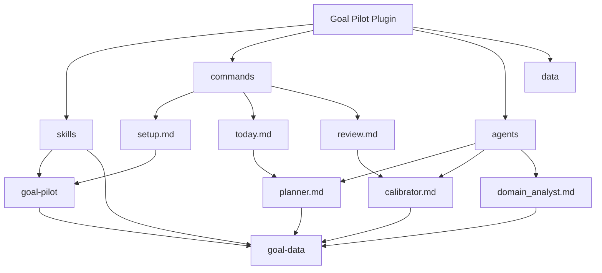

# Goal Pilot - AI Context Document

> Claude Code Plugin: Personal goal achievement pilot with dynamic review and calibration

## Project Vision

Goal Pilot transforms annual goals into actionable daily tasks with:
- Structured data persistence (CSV/JSON)
- Layered context decay (older data has less weight)
- Automatic calibration based on detected patterns
- Multi-language support (English, Chinese, Japanese)

## Architecture Overview

```
goal-pilot-plugin/
├── .claude-plugin/          # Plugin manifest
│   └── plugin.json
├── skills/                  # Core capabilities
│   ├── goal-pilot/          # Main skill
│   └── goal-data/           # Data layer operations
├── commands/                # Slash commands
│   ├── setup.md             # /goal-pilot:setup
│   ├── today.md             # /goal-pilot:today
│   └── review.md            # /goal-pilot:review
├── agents/                  # Subagents
│   ├── planner.md           # Task planning
│   ├── calibrator.md        # Calibration rules
│   └── domain_analyst.md    # Domain analysis
├── data/                    # User data (runtime)
│   ├── state.json           # Goal, milestones, calibration
│   ├── reviews_*.csv        # Review records
│   ├── summaries_*.csv      # Aggregated summaries
│   └── pins.csv             # Long-term constraints
└── openspec/                # Change proposals
```

## Module Structure



## Module Index

| Module | Path | Description |
|--------|------|-------------|
| goal-pilot | `skills/goal-pilot/` | Core skill - goal framework, task generation, reviews |
| goal-data | `skills/goal-data/` | Data layer - CSV/JSON operations, decay calculation |
| commands | `commands/` | Slash commands: setup, today, review |
| agents | `agents/` | Subagents: planner, calibrator, domain_analyst |
| data | `data/` | User data storage (CSV/JSON files) |
| openspec | `openspec/` | Change proposal system |

## Core Concepts

### Data Flow

```
/goal-pilot:setup    ->  state.json (goal, milestones)
                  CSV files (empty with headers)

/goal-pilot:today    ->  Load state + context (L0/L1/pins)
                  Apply decay weights
                  Invoke planner subagent
                  Output: Top 3 Outcomes

/goal-pilot:review   ->  Collect structured fields
                  Append to CSV
                  Invoke calibrator subagent
                  Update state.json
```

### Layered Context Retrieval

| Layer | Age | Content | Weight |
|-------|-----|---------|--------|
| L0 | 0-7 days | Full daily reviews | High (1.0 - 0.84) |
| L0 partial | 8-30 days | Key fields only | Medium |
| L1 | 31-90 days | Weekly summaries | Medium-Low |
| L2 | 91-365 days | Monthly summaries | Low |
| Pins | Any | Active pins | Always 1.0 |

### Calibration Rules

**Hard Rules (Automatic):**
- `unclear_next_action` >= 3 times in 7 days -> `force_small_steps = true`
- `scope_too_big` >= 2 times in 7 days -> `force_split_outcomes = true`
- `low_energy` >= 3 times in 7 days -> `low_friction_mode = true`

**Progress Deviation:**
- `behind_ratio` >= 0.15 -> Yellow warning
- `behind_ratio` >= 0.30 -> Red alert (blocks /goal-pilot:today)

## Running and Development

### Commands

| Command | Description |
|---------|-------------|
| `/goal-pilot:setup` | Initialize goal framework, create data files |
| `/goal-pilot:today` | Generate today's tasks with layered context |
| `/goal-pilot:review` | Daily review (default) |
| `/goal-pilot:review week` | Weekly review + summary generation |
| `/goal-pilot:review month` | Monthly review + summary generation |

### Natural Language Support

| Phrase | Maps To |
|--------|---------|
| "What's today's task?" / "What should I do today?" | `/goal-pilot:today` |
| "Do a review" / "End of day review" | `/goal-pilot:review` |
| "Weekly review" | `/goal-pilot:review week` |
| "Monthly review" | `/goal-pilot:review month` |

## Testing Strategy

This is a prompt-based plugin without executable code. Testing is done through:
- Manual testing with Claude Code CLI
- Example conversations in `skills/goal-pilot/EXAMPLES.md`
- Review templates in `skills/goal-pilot/REVIEWS.md`

## Coding Conventions

### File Naming
- Commands: lowercase with `.md` extension
- Agents: snake_case with `.md` extension
- Skills: UPPERCASE.md for main files

### Documentation Style
- YAML frontmatter for metadata
- Markdown with structured sections
- Code blocks for examples and schemas

### Data Schemas
- JSON Schema v2.0 for `state.json`
- CSV headers defined in `goal-data/SKILL.md`
- ISO-8601 date format throughout

## AI Usage Guidelines

### When Working on This Project

1. **Read skills first**: Start with `skills/goal-pilot/SKILL.md` for core understanding
2. **Check data schemas**: `skills/goal-data/SKILL.md` defines all data structures
3. **Understand flow**: Commands invoke agents which use skills
4. **Respect calibration**: Hard rules are deterministic, soft rules are suggestions

### Key Files to Reference

| Purpose | File |
|---------|------|
| Main skill definition | `skills/goal-pilot/SKILL.md` |
| Data operations | `skills/goal-data/SKILL.md` |
| State schema | `data/state.example.json` |
| Plugin manifest | `.claude-plugin/plugin.json` |

### Common Tasks

| Task | Approach |
|------|----------|
| Add new command | Create in `commands/`, register in `plugin.json` |
| Modify calibration | Update `agents/calibrator.md` and `skills/goal-data/SKILL.md` |
| Add new domain | Extend `agents/domain_analyst.md` |
| Change data schema | Update `skills/goal-data/SKILL.md` and example files |

## Changelog

| Date | Change |
|------|--------|
| 2026-01-19 | Initial AI context document generated |

---

